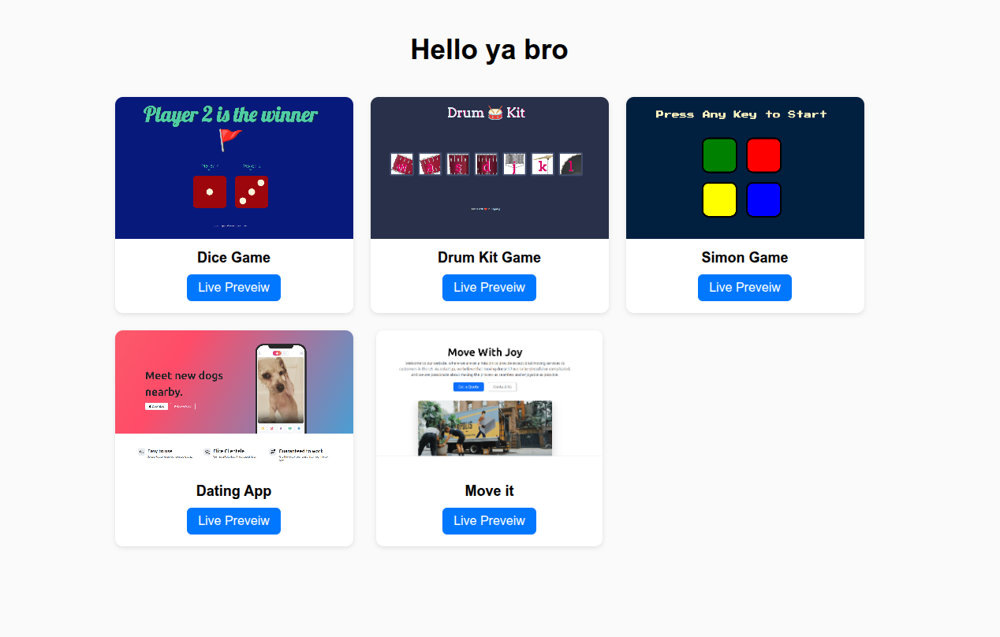

# 💻 Web Development Bootcamp

This repository contains my practice work, mini-projects  
I’m using this repo to document my learning journey as I master both **front-end** and **back-end** web development.

To get the live preivews go to the following webpage  
https://hazem-ta.github.io/web-development-camp/
 

## 🧭 Overview

Through this course, I’m building a solid understanding of:
- 🧱 HTML & CSS fundamentals  
- 🎨 Responsive design with Flexbox and Bootstrap  
- ⚙️ JavaScript (ES6) and DOM manipulation  
- 🧠 APIs and JSON  
- ⚡ Node.js & Express.js  
- 🗄️ MongoDB & Mongoose  
- 🔒 Authentication and security  
- ☁️ Deployment on GitHub Pages and Render  

 

## 🚀 Live Projects

| Project           | Description                                     | Live Demo                                                                        |
| ------------------| ----------------------------------------------- | -------------------------------------------------------------------------------- |
| Dice Game         | JavaScript DOM manipulation game                | [View](https://hazem-ta.github.io/web-development-camp/games/dicee-game/dicee.html)  |
| Drum Kit          | Interactive web app using JS events             | [View](https://hazem-ta.github.io/web-development-camp/games/drum-kit-game/index.html)   |
| Simon Game        | Memory challenge game using jQuery              | [View](https://hazem-ta.github.io/web-development-camp/games/simon-game/index.html) |
| Dating App        | Dating for dogs (you are read it reight)        | [View](https://hazem-ta.github.io/web-development-camp/websites/dating-app-landpage/index.html) |
| Move It           | Website for shipping company                    | [View](https://hazem-ta.github.io/web-development-camp/websites/shipping-company-website/index.html) |

 

## 🧰 Technologies Used

### 🖥️ Front-End
* HTML5, CSS3, Bootstrap  
* JavaScript (ES6), jQuery  
* DOM Manipulation & Events  

### ⚙️ Back-End
* Node.js, Express.js  
* MongoDB, Mongoose  
* EJS templating  
* Passport.js & bcrypt for Authentication  

### 🧪 Tools & Platforms
* Git & GitHub  
* VS Code  
* Postman  
* Render (for deployment)  

 

## 🧠 Key Learnings

* Building responsive and interactive front-end designs  
* Handling user interactions with JavaScript  
* Creating RESTful APIs and routing in Express  
* Connecting to MongoDB and performing CRUD operations  
* Implementing authentication and user sessions  
* Deploying full-stack applications online  

 

## 🤝 Acknowledgements

A huge thanks to **Angela Yu** and the **London App Brewery** team  
for creating one of the most comprehensive and enjoyable web development courses out there! 💙
